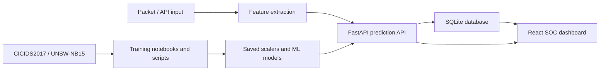

# SENTINEL IDS - Real-Time Intrusion Detection Dashboard

SENTINEL IDS is a full-stack intrusion detection system that combines machine learning models, a FastAPI backend, SQLite storage, and a React dashboard for live security monitoring.

## Main Features

- Real-time IDS dashboard with traffic, alerts, analytics, and controls
- FastAPI backend with health, auth, logs, stats, alerts, metrics, config, and prediction APIs
- Hybrid ML detection using Random Forest and Isolation Forest models
- CICIDS2017 and UNSW-NB15 datasets included for training and evaluation
- SQLite event and alert storage
- Dashboard uses live backend records; empty systems show zero/empty states instead of random fake traffic
- Docker support for backend and frontend
- Automated backend tests for demo confidence

## Architecture



## Tech Stack

- Backend: Python, FastAPI, scikit-learn, pandas, SQLite
- Frontend: React, TypeScript, TanStack Router, Recharts, Three.js
- ML: Random Forest and Isolation Forest
- Deployment: Docker and Docker Compose

## Setup

Create and activate a virtual environment:

```powershell
python -m venv .venv
.\.venv\Scripts\activate
```

Install backend dependencies:

```powershell
pip install -r requirements.txt
```

Install frontend dependencies:

```powershell
cd Dashboard
npm install
```

## Run The Project

Start the backend:

```powershell
.\.venv\Scripts\python.exe run_server.py
```

Backend URL:

```text
http://localhost:8000
```

API docs:

```text
http://localhost:8000/docs
```

Start the frontend:

```powershell
cd Dashboard
npm run dev
```

Frontend URL:

```text
http://localhost:5173
```

## Demo Prediction

Send a 15-feature sample to the prediction API:

```powershell
Invoke-RestMethod -Method Post `
  -Uri http://localhost:8000/api/predict `
  -ContentType "application/json" `
  -Body '{"features":[6,0,0,0,0,0,0,1,0,64,1200,10,8,5000,15],"model_key":"Set-1"}'
```

Expected response includes:

- `prediction`: `NORMAL` or `ATTACK`
- `model_key`: selected model set
- `details.rf_confidence`: Random Forest confidence
- `details.unsupervised_prediction`: Isolation Forest output

## Important API Endpoints

| Endpoint | Purpose |
| --- | --- |
| `GET /api/health` | Backend health check |
| `POST /api/predict` | Run ML prediction |
| `GET /api/live-stats` | Dashboard live stats |
| `GET /api/attack-rate` | Traffic chart data |
| `GET /api/alerts/recent` | Recent threat alerts |
| `GET /api/logs` | Event logs |
| `GET /api/config` | Detection settings |
| `POST /api/config/update` | Update detection settings |

## Model Feature Order

The default prediction endpoint expects 15 numeric features:

1. Protocol
2. Fwd IAT Total
3. Flow IAT Mean
4. Flow IAT Max
5. Flow IAT Min
6. PSH Flag Count
7. FIN Flag Count
8. ACK Flag Count
9. SYN Flag Count
10. Average Packet Size
11. Flow Duration
12. Total Fwd Packets
13. Total Backward Packets
14. Flow Bytes/s
15. Flow Packets/s

## Testing

Run backend tests:

```powershell
.\.venv\Scripts\python.exe -m pytest tests
```

Current verification:

- Backend tests: `5 passed`
- Frontend build: `npm run build` passes

## Evaluation Results

See `RESULTS.md` for the reproducible model evaluation snapshot.

Summary for `Set-1` on a balanced CICIDS2017 DDoS sample:

- Accuracy: 92.38%
- Precision: 100.00%
- Recall: 84.76%
- F1-score: 91.75%

Run the broader CICIDS2017 benchmark:

```powershell
.\.venv\Scripts\python.exe Scripts\evaluate_sample.py --all-cicids --model-key Set-1 --sample-size 1000
```

The broader benchmark shows that `Set-1` performs best on DDoS and needs retraining or model selection for other attack families. This is documented in `RESULTS.md`.

## Live Packet Capture On Windows

Live capture uses Scapy. On Windows:

- Run PowerShell as Administrator.
- Install Npcap if Scapy cannot capture packets.
- During Npcap installation, enable WinPcap-compatible mode.

Run capture mode:

```powershell
.\.venv\Scripts\python.exe run.py
```

If capture cannot start, the pipeline now prints a clear message explaining whether Administrator permissions or Npcap are needed.

## Docker

Run both services:

```powershell
docker compose up --build
```

Services:

- Backend: `http://localhost:8000`
- Frontend: `http://localhost:5173`

## Submission Notes

Before submitting, do not include generated dependency folders:

- `.venv`
- `Dashboard/node_modules`
- `Dashboard/dist`
- `__pycache__`

They are ignored in `.gitignore` and can be rebuilt from `requirements.txt` and `Dashboard/package.json`.
